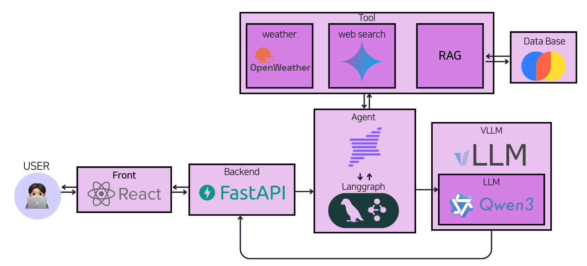

# README

# 여행친구 (여친)

## 0. 시연 영상
[프로젝트 데모 영상 보기](./assets/demo.mp4)

## 1. 프로젝트 개요

### 1.1 프로젝트 주제

 본 프로젝트는 딱딱한 비서형 LLM이 아니라, 카톡하듯 여행 계획을 완성해주는 친구형 여행 에이전트를 구현하였다. 단발성 체인이 아닌 State 를 유지하는 에이전트 구조를 이용하여 구축하는 것을 목표로 하였다.

### 1.2 주요 전략 및 방법론

 병렬적인 Tool동작, 정확성을 높이는 순환구조를 위해 LangGraph를 도입하였고, 에이전트의 친근한 답변을 위해 Qwen3-4B-Instruct 모델에 AI-Hub의 한국어 SNS 멀티턴 대화 데이터로  SFT와 DPO를 QLoRA 학습하여 챗봇Tool로 구현하였다

### 1.3 데이터셋

SNS 멀티턴 대화 데이터를 통해 고유의 페르소나를 구축하였으며, 여기에 RAG 기반의 최신 여행 지식을 결합하여 풍부하고 정확한 응답 생성이 가능하도록 설계하였다.

#### Train 데이터셋 (페르소나 대화 학습용)

- AI Hub 한국어 SNS 멀티턴 대화 데이터셋(여행 카테고리) - 2인 대화, 약 1.3만 대화 추출

#### RAG 데이터셋 (최신 여행 정보 검색용)
- 카카오맵 크롤링
    - 최신 정보 반영을 위해 2025년 기준 최신 리뷰 데이터 3개 크롤링
    - Selenium + BeautifulSoup 기반 동적 크롤링
- ‘비짓부산’ 홈페이지의 《블루리본 2025》, 《택슐랭 2025》 등 가이드북 16개
    - PyMuPDF 와 LLM을 이용해 데이터 정제 및 청크 구성

## **2. 팀원 소개 및 역할**

| 이름 | 프로필 | 역할 |
| :---: | :---: | --- |
| **김영현**<br>[](https://github.com/Kimyoung-hyun) |  | RAG 구축, LangGraph 구현 |
| **윤준상**<br>[](https://github.com/JunandSang) |  | EDA, 프론트엔드 구현, Agent Tool 설계 |
| **장세현**<br>[](https://github.com/sucruba70) |  | SFT 데이터 전처리,  LangGraph 구현, Agent Tool 설계 |
| **주현민**<br>[](https://github.com/zoosumzoosum) |  | SFT데이터 수집/EDA , 페르소나 학습, 발표자료 제작 및 발표 |
| **한지석**<br>[](https://github.com/jis-archive) |  | DPO 학습 데이터 구축, DPO 학습, RAG 평가 파이프라인 설계, 모델 서빙 |


## 3. 파이프라인




## 4. 디렉토리 구조

```bash
📦 project-root
│
├── 📁 backend                 # LoRA 병합 및 모델 서빙
│   ├── merge_lora_weights.py
│   └── server.py
│
├── 📁 src                     # 핵심 로직
│   │
│   ├── 📁 agent               # 에이전트 및 대화 흐름 관리
│   │   ├── graph.py
│   │   ├── states.py
│   │   ├── 📁 prompt          # 프롬프트 정의
│   │   │   └── prompt.py
│   │   └── 📁 tool            # 외부 도구 연동
│   │       └── weather.py
│   │
│   ├── 📁 rag                 # RAG 검색 및 평가 모듈
│   │   ├── data_loader.py
│   │   ├── hybrid_retriever.py
│   │   ├── rag.py
│   │   ├── rag_builder.py
│   │   └── 📁 metric
│   │       ├── generate_testdata.py
│   │       └── test_rag.py
│   │
│   ├── 📁 common              # 공통 유틸리티
│   │   ├── set_seed.py
│   │   └── wandb.py
│   │
│   ├── 📁 dpo                 # DPO 학습 파이프라인
│   │   ├── evaluate_chatbot.py
│   │   ├── generate_dpo_dataset.py
│   │   ├── train_dpo.py
│   │   ├── 📁 data
│   │   │   ├── custom_distilabel.py
│   │   │   └── dpo_data_loader.py
│   │   └── 📁 training
│   │       ├── dpo_trainer.py
│   │       └── model_loader.py
│   │
│   └── 📁 sft                 # SFT 학습 파이프라인
│       ├── train_sft.py
│       ├── 📁 data
│       │   ├── collator.py
│       │   ├── data_loader.py
│       │   └── preprocessor.py
│       └── 📁 training
│           ├── model_loader.py
│           └── trainer.py
│
├── 📁 frontend                # 사용자 인터페이스 (React)
│   └── src
│       ├── App.css
│       ├── App.js
│       ├── index.css
│       └── index.js
│
├── 📁 scripts                 # 실행 자동화 스크립트
│   ├── generate_dataset
│   ├── rag
│   ├── serving
│   └── train
│
├── 📁 configs                 # 설정 파일
│   ├── dpo_config.yaml
│   ├── rag.yaml
│   ├── rag_metric.yaml
│   └── sft_config.yaml
│
└── 📁 notebooks               # 실험 및 분석 노트북

```

## 5. 실행 방법

본 프로젝트는 **RAG 구축 → 모델 학습 → 서빙 및 웹 실행** 순서로 진행됩니다.

세팅을 직접하려면 `dpo_config.yaml`, `rag.yaml`, `rag_metric.yaml`, `sft_config.yaml` 를 참고해주세요.

**RAG 구축**

```bash
# 벡터 DB 생성
bash scripts/rag/build_rag.sh
```

**SFT 및 DPO 학습**
```bash
# 모델 SFT 학습 예시
bash scripts/sft/train_sft.sh

# 모델 DPO 학습 예시
bash scripts/dpo/train_dpo.sh
```

**서비스 서빙**
```bash
# 기본 사용법
bash scripts/serving/serve_model.sh
bash scripts/serving/serve_app.sh 

cd frontend
npm start

```

## 6. Wrap-Up Report

프로젝트 전반의 시행착오와 솔루션 및 회고는 [FinalProject_NLP_13.pdf](./assets/finalproject-nlp-13.pdf) 을 통해 확인할 수 있습니다.
